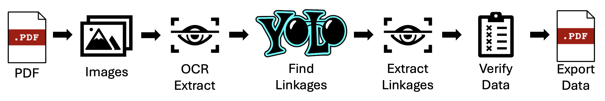
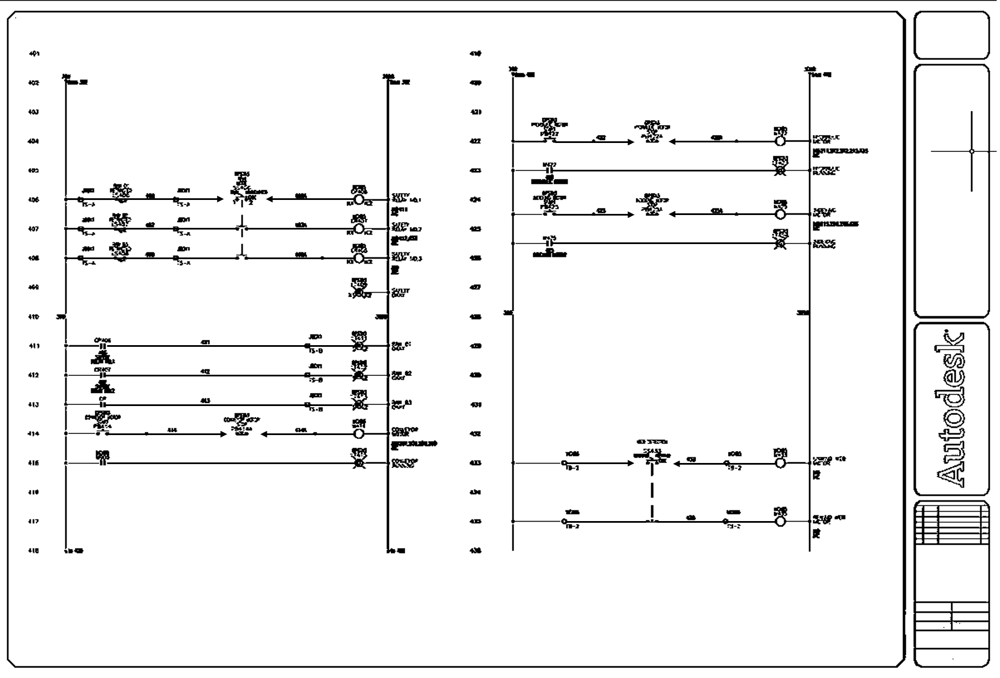
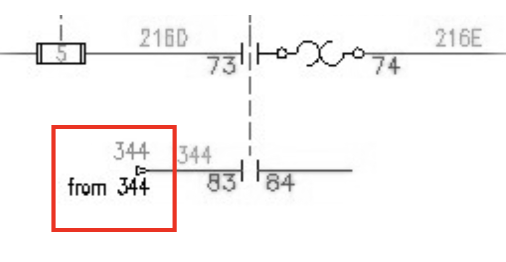
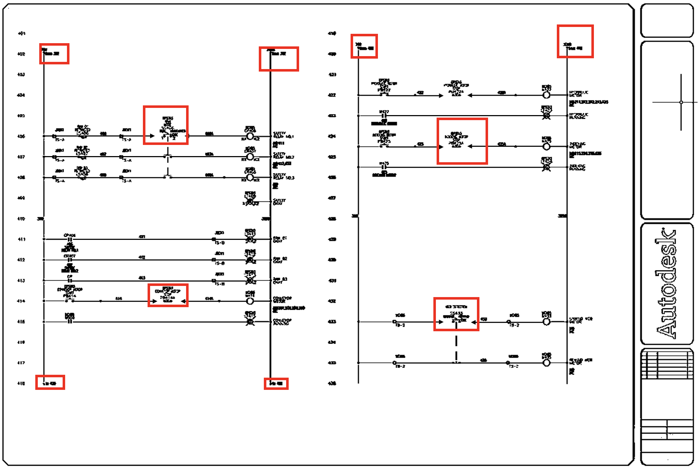
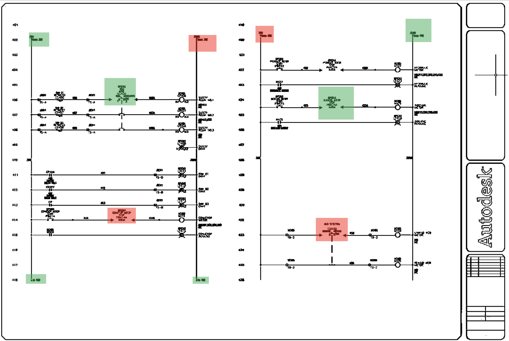

# Capstone Project: OCR verification of Electrical Schematics in Complex Environments

---

### Note
Due to the sensitive nature of this project involving proprietary company materials and trade secrets, the code and research report cannot be shared publicly. However, this provides an overview of my work.

To maintain confidentiality, all images used in this summary are augmented versions of publically available schematics found online (see links below). Some processes have been simplified and numerical values rounded off for security purposes.

- Schematic Base Image: [Here](https://www.autodesk.com/content/dam/autodesk/www/products/autocad/fy21/toolsets/autocad-electrical/images/autocad-electrical-toolset-large-1920x1050.jpg)
- Linkage Base Image: [Here](https://files.upskill-dev.autodesk.com/public/CSO_Content/IMAGES/MEE-AE0003_1610993128_71.jpg)

---

### Motivation  
<!-- PAR Systems is an automation integrator specializing in custom equipment for a variety of industries including medical, aerospace, nuclear, and many more. The process of designign a machine includes creating electrical schematics for each build. It is of the utmost importance that these schematics are accurate before a machine is built to minimize unnecesaary costs. One of the most tedious tasks in verifying electrical schematics involves checking to ensure all cable linkages are properly called out. On larger projects, this can take dozens of hours to verify manually.  -->
<!-- As an employee of PAR Systems, an automation integrator specializing in custom equipment for industries such as medical, aerospace, nuclear, and more, I have become familiar with the importance of accurate electrical schematics. Since the machines are custom, and designed from the ground up, these documents need to be heavily reviewed for their accuracy. These designs are critical to minimizing unnecessary costs associated with machine builds.

One of the most time-consuming tasks in verifying these schematics is manually checking cable linkages, which can take dozens of hours on larger projects. This tedious process can result in errors or inaccuracies that can have significant, costly, consequences. -->
At PAR Systems, an automation integrator specializing in custom equipment for industries such as medical, aerospace, nuclear, and more, accurate electrical schematics play a crucial role. Because the machines are custom-designed from the ground up, these documents require thorough review to ensure accuracy. Such designs are essential for minimizing unnecessary costs associated with machine builds.

One of the most time-consuming aspects of verifying these schematics is manually checking cable linkages, a process that can take dozens of hours on larger projects. This tedious task is prone to errors and inaccuracies, which can lead to significant and costly consequences.

---

### Problem Definition  
<!-- The purpose of this project is to create a piece of software that can verify the existance and integrity of all cable linkages in a set of schematics. The program should ensure the accuracy is at or above the accuracy of a human, estiamted to be 80%, and try to minimize false positive verifications. -->
The primary objective of this project was to develop a software solution capable of accurately verifying the existence and integrity of all cable linkages within electrical schematics. The program aimed to achieve an accuracy rate at least as high as human verification (estimated at 80%) while minimizing false positive verifications. Additionally, the program needs to be run completely locally to comply with security concerns.

---

<!-- ### Proposed Approach  
To perfrom the cable linkage verification, basic image processing techniques are used to extract page data such as row numbers, column numbers. YOLO search can be used to locate the linkages, and OCR will can be used to exttract the necessary linkage information.

Key benefits of this approach include:  
- **Efficiency:** Lightweight object detection is used instead of computationally heavy convolution searches.  
- **Modularity:** Framework allows individual aspects of the process to be changed while maintaining the rest of the pipeline

The image below shows an example of the pipeline and framework. -->
### Proposed Approach 
The image below illustrates an example of this proposed solution's architecture, showcasing how each component works together in series to achieve accurate cable linkage verification.

  

This approach offers several advantages:

- **Efficiency:** By utilizing lightweight object detection instead of computationally intensive convolution searches, we can significantly reduce the verification time.
- **Modularity:** The framework is designed to be modular, allowing individual components to be updated or replaced without disrupting the entire pipeline. This flexibility enables seamless integration with future improvements and enhancements.

---

### System Process

#### 1. **PDF Ingestion and Image Conversion**  
<!-- There are a variety of different formats files have been saved over the years. Some prints were saved as scanned copys of prints, some pdf prints, and some autocad files. To make the program as simple as possible, electrical schematics were ingested as a pdf, and each page was turned into a 300 dpi image. The image below shows a sample of a schematic that the program could ingest -->
To simplify the analysis process, the electrical schematics were ingested as PDFs and each page was converted to a high-resolution (300 dpi) image. This format allows for efficient processing and minimizes data loss. The sample schematic below illustrates the type of input our system can handle.

  

#### 2. **Column and Row Number Extraction**  
<!-- Column and row numbers are extracted using a variety of image processing techniques. First the images are cropped to eliminate any padding beyond the border of the schematic. Then, OCR is run on a hard coded region on the page to determine the page number. This is possible since all the drawings follow a rigid template. Next convolution is run to find two of the row numbers. Based on the convolutional sample with the highest similarity to the template image, we extract a location that is used to extrapolate the rest of the row numbers. Once again, the template format allows this process to be very accurate -->
The column and row number extracting algorithm employs advanced image processing techniques to accurately extract column and row numbers from schematics. First, we remove unnecessary padding by cropping images to their borders. Next, Optical Character Recognition (OCR) is applied within a predefined region on each page to identify the column number. Leveraging the rigid template used in all drawings, convolutional methods were utilized to locate two key row numbers. By extrapolating from these anchor points, the location of the remaining row numbers can be accurately determined.

#### 3. **YOLO Search: Cable Linkage Detection**  
<!-- A YOLO (You Only Look Once) model was fine tuned to recognize cable linkages in the schematics. Cable linkages are callouts that link wires on different pages to each other. An example of a cable linkage is shown in the image below -->
A YOLO model was fine-tuned to identify cable linkages – critical callouts that connect wires across different pages of schematics. The example image below demonstrates this feature in action. This capability enables the system to effectively analyze and understand the relationships between various components within electrical diagrams. The YOLO search algorithm proved to be the best agent determining whether a cable linkage was present.

  

<!-- Since there is not a dataset already created and labeled for this task, one was created just for this projet. The dataset consisted of ~3300 training samples and another ~400 test samples. The YOLO model was fine tuned for 5 epochs, and used YOLOv11n as the base model. -->
To address the lack of pre-existing datasets for this task, a custom dataset was created specifically for this project. Comprising approximately 3,300 training samples and 400 test samples, it provided an adequate foundation for model development. The YOLOv11n base model was fine-tuned over five epochs, resulting in the best model tested.

<!-- Once the model was trained, it was used to recognize cable linkages in the images. At a confidence threshold of 85%, the model was only able to identify linkages with an accuracy ~50%. However the project does not penalize false positive YOLO identifications as long as the later OCR and postprocessing steps catch the mistake. Therefore the threshold for the model was set to 30%, and the accuracy of the model had an accuacy well over 85%. An example of YOLO search outputs is shown below: -->
While the initial confidence threshold of 85% yielded only 50% accuracy in identifying cable linkages, subsequent post-processing steps allowed us to relax this requirement and set a lower threshold (30%) without compromising overall system reliability. This approach ensured that YOLO search found significantly more linkages (90+%), even if some false positives occurred.

  

#### 4. **OCR Linkage Text Extraction and Validation**  
<!-- To extract the numbers from the cable linkages, OCR (Optical Character Recognition) was utilized. Two different models were used: TesserOCR and EasyOCR. Since all computation had to be perfromed locally, cloud services could not be utilized. For the scope of this project, only numbers were whitelisted. The function would ingest an image and return a list of the numbers in the image from each model. The results of the two models were then compared. Each cable linkage needed to be 3-5 digits in length to be included in the identified list. Next, the numebrs that appeared in both OCR engines were added to a "significant digits" list. and the overall instance was assigned a confidence score based on the similarity of the two different OCR engine outputs. -->
To extract numerical data from cable linkages, Optical Character Recognition (OCR) techniques were leveraged using two robust models: TesserOCR and EasyOCR. Given the project's local computation constraints, cloud services were not utilized. To ensure accuracy, only numbers were whitelisted for extraction.

The algorithm ingested images of cable linkages and returned a list of extracted numbers from each model. A comparative analysis was then performed to identify commonalities between the two OCR engine outputs. Numbers appearing in both models with lengths ranging from 3-5 digits were added to a "significant digits" list, while an instance-specific confidence score was assigned based on the similarity of the two OCR engine results.

#### 5. **Verification and Data Export**  
<!-- A verification algorithm was run to check that at the source of a linkage, there is a destination, and at that destination there is a link back to the source. All the raw text data was exported as a .csv file for review, and a pdf was exported. If the verificaiton algorithm was confident enough the linkage existed, the interior of the bounding box for that linkage was turned green, if not it remained red on the export.  -->
A verification algorithm was run to confirm that each linkage had a valid source-to-destination connection with a return link back to its origin. The raw text data was exported in both CSV format for review and PDF format for visual interpretation. A color-coded indicator system was implemented, where the interior of bounding boxes surrounding verified linkages turned green, indicating confidence in their existence, while unverified connections remained red upon export.

  

<!-- --- -->

<!-- ### Experimental Results  
To evaluate the system, we conducted user preference surveys comparing responses generated by:  
- A standalone Vision-Language Model (VLM).  
- The proposed navigation module integrated with an LLM.

Participants reviewed side-by-side video outputs and rated the usefulness of each system on a scale of 1–5.  -->

---

### Main Findings and Experimental Results
- **Strengths:**  
  <!-- - Exceptional recognition of linkages by YOLO model  
  - Image preprocessing is very successful -->
  - Exceptional recognition of linkages by YOLO model, demonstrating its potential for accurate identification.
  - Image preprocessing achieved remarkable success rates, laying a solid foundation for further development.

<!-- - **Challenges:**  
  - OCR accuracy: Extracting the text from the smaller images identified by YOLO search proved to be the most difficult part ofthe project. Nearly all of the error in the program is due to incorrect extraction of text by the OCR algorithms.
  - Dealing with deviations from company standards -->
- **Challenges and Areas for Improvement:**
  - OCR accuracy proved to be the most significant hurdle in our project. The extraction of text from smaller images identified by YOLO search was particularly challenging, resulting in nearly all errors being attributed to incorrect text extraction by OCR algorithms.
  - Adapting to deviations from company standards presented another challenge that required careful consideration.

<!-- Overall, the project was successful in creating the full program that could identify and verify cable linkages computed locally. The accuracy was not close to the proposed human accuracy of ~80%. -->
Despite these challenges, a program was successfully developed capable of identifying and verifying cable linkages computed locally. While the accuracy fell short of our proposed human benchmark (~80%), this project marked an important step towards creating a more efficient system for linkage verification.

---

### Potential Impact  
<!-- This work represents a promising step forward in helping PAR automate some internal review processes. Hundreds of hours are spend on this task every year. Additionally it exposes the company employees to these technologies and empowers them to explore other avenues they could be utilized for company process improvement. -->
This project marks a significant milestone towards automating internal review processes at PAR, possibly saving hundreds of hours annually and empowering employees with cutting-edge technologies that can drive further process improvements across the company.

---

### Limitations and Future Work  
<!-- - **OCR Reliability:** The reliability of OCR models was not suffiecient to be trusted in an industrial setting
- **Linkage Detection:** The YOLO model was not able to identify all intances of linkages 
- **Information Parsing:** Information parsing techniques were very limited due to the secret nature of the software, and the desire to use free, open source technologies.  -->
- **OCR Reliability:** Despite its potential, the investigation revealed limitations in relying on OCR models for industrial-grade accuracy.
- **Linkage Detection:** The YOLO model's performance fell short of expectations when it came to detecting all instances of linkages within documents.
- **Information Parsing:** Efforts were hindered by the proprietary nature of the drawings and a need to utilize free, open-source technologies. This limited the ability to develop more sophisticated information parsing techniques.

<!-- Future improvements may include implementing this software on the current company template with improved YOLO models and a fine tuned OCR engine build specifically for the task. Additional variations of this software could be used to investigate the underlying text data in new PDF documents instead of turning them into an image. -->
Future developments may involve integrating this solution with PAR's current template using enhanced YOLO models and fine-tuned OCR engines specifically designed for this task. Alternatively, variations of this project could be explored to analyze underlying text data in new PDF documents, rather than converting them into images.

---

### Collaboration  
<!-- This project was performed in conjunction with PAR Systems, and the University of Minnesota. A special thank you to Sam Johnson at PAR Systems, and my advisor Vasillios Morellas at the University of Minnesota. -->
This capstone project was undertaken in collaboration with PAR Systems and the University of Minnesota. I would like to extend sincere gratitude to Sam Johnson from PAR Systems for his invaluable support and guidance, as well as my advisor Vasillios Morellas at the University of Minnesota for his expert mentorship throughout this endeavor.